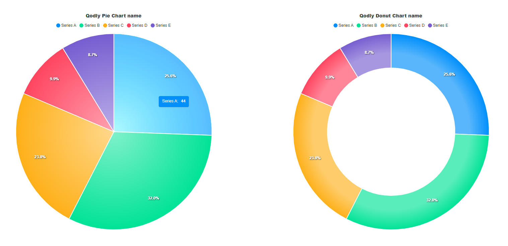
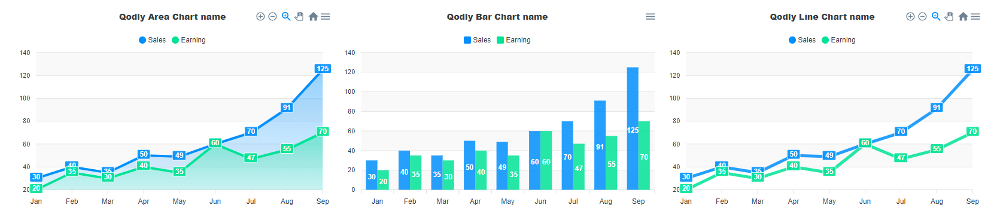

# Overview Qodly_ApexCharts

Qodly Chart Component using [ApexCharts.js](https://apexcharts.com/)

## Pie & Donut Chart

Pie and donut charts are the same, with the only difference being that the donut chart has a hole in the center.
The DataSource can be exactly the same for both of them.



| Name              | Type             | Description                                                                                                                                         |
| ----------------- | ---------------- | --------------------------------------------------------------------------------------------------------------------------------------------------- |
| `Title`           | String           | Chart Title.                                                                                                                                        |
| `Title Position`  | String           | Chart Title position, the value can be among the following: `left`,`center`,`right`, By default the value is `center`.                              |
| `Legend Position` | String           | Position of the legend, the value can be among the following: `top`, `bottom`, `left`,`right`,`hidden`, By default the value is `top`.              |
| `Chart Type`      | String           | Type of the chart, the value can be among the following: `Pie`, `Doughnut`, The default value depends on the component that was initially selected. |
| `Gradient`        | Boolean          | Define if the chart's color is a gradient or not                                                                                                    |
| `Display Labels`  | Boolean          | Define if the data labels are displayed on the chart                                                                                                |
| `DataSource`      | Object or String | Structure of the chart, containing the datas                                                                                                        |

#### DataSource

The datasource can be a JSON object or the equivalent string (JSON stringified).
| Name      | Type   | Required | Description                                                                            |
| --------- | ------ | -------- | -------------------------------------------------------------------------------------- |
| `series`  | Array  | Yes      | Data corresponding to the Labels (Should have the same number of values as the labels) |
| `options` | Object | Yes      | The value for the dataset.                                                             |

If you are looking for more precise informations about the `options` object, you can refer to the [ApexCharts.js documentation](https://apexcharts.com/docs/) in the “Options (Reference)” section.


an example of data that can be used :

```Json
{
    "series": [
        44,
        55,
        41,
        17,
        15
    ],
    "options": {
        "labels": [
            "Series A",
            "Series B",
            "Series C",
            "Series D",
            "Series E"
        ]
    }
}
```

## Area & Bar & Line Charts

Area, Bar and Line charts are nearly the same some options are not available on the Bar one.
The DataSource can be exactly the same for all of them.



| Name              | Type             | Description                                                                                                                                                                                 |
| ----------------- | ---------------- | ------------------------------------------------------------------------------------------------------------------------------------------------------------------------------------------- |
| `Title`           | String           | Chart Title.                                                                                                                                                                                |
| `Title Position`  | String           | Chart Title position, the value can be among the following: `left`,`center`,`right`, By default the value is `center`.                                                                      |
| `Legend Position` | String           | Position of the legend, the value can be among the following: `top`, `bottom`, `left`,`right`,`hidden`. By default the value is `top`.                                                      |
| `Chart Type`      | String           | Type of the chart, the value can be among the following: `Area`, `Bar`, `Line`. The default value depends on the component that was initially selected.                                     |
| `Stroke Curve`    | String           | Curve of the stroke, the value can be among the following: `Straight`, `Smooth`, `Monotone Cubic`,`Stepline`. By default the value is `Straight`. This options is not working on Bar charts |
| `X Axis Title`    | String           | Optional: Text that describe the data on the X Axis                                                                                                                                         |
| `Y Axis Title`    | String           | Optional: Text that describe the data on the Y Axis                                                                                                                                         |
| `Zoomable`        | Boolean          | Define if the chart is zoomable. This options is not working on Bar charts                                                                                                                  |
| `Exportable`      | Boolean          | Define if the chart is Exportable. (Available formats are: SVG, PNG and CSV)                                                                                                                |
| `Display Labels`  | Boolean          | Define if the data labels are displayed on the chart                                                                                                                                        |
| `Annotations`     | Annotation       | Add an annotation, not available. This options is not working on Bar charts                                                                                                                 |
| `DataSource`      | Object or String | Structure of the chart, containing the datas                                                                                                                                                |

#### Annotation

The datasource can be a JSON object or the equivalent string (JSON stringified).
| Name              | Type            | Description                                                                                                                              |
| ----------------- | --------------- | ---------------------------------------------------------------------------------------------------------------------------------------- |
| `Text`            | String          | Data corresponding to labels (must have the same number of values ​​as labels)                                                           |
| `Axis`            | String          | Type and direction of the annotation, the value can be among the following: `X`,`Y`,`Point`, By default the value is `X`.                |
| `Coordinate Type` | String          | Type of the following coordinates, the value can be among the following: `String`,`Number`,`Datetime`, By default the value is `String`. |
| `From`            | Coordinate type | The starting coordinate of the annotation.                                                                                               |
| `To`              | Coordinate type | The ending coordinate of the annotation.                                                                                                 |
| `BackgroundColor` | Color           | The color of the background of the annotation.                                                                                           |
| `BorderColor`     | Color           | The color of the border of the annotation.                                                                                               |

#### DataSource

The datasource can be a JSON object or the equivalent string (JSON stringified).
| Name      | Type   | Required | Description                                                                    |
| --------- | ------ | -------- | ------------------------------------------------------------------------------ |
| `series`  | Array  | Yes      | Data corresponding to labels (must have the same number of values ​​as labels) |
| `options` | Object | Yes      | The value for the dataset.                                                     |

If you are looking for more precise informations about the `options` object, you can refer to the [ApexCharts.js documentation](https://apexcharts.com/docs/) in the “Options (Reference)” section.


an example of data that can be used :

```Json
{
    "options": {
        "xaxis": {
            "categories": [
                "Jan",
                "Feb",
                "Mar",
                "Apr",
                "May",
                "Jun",
                "Jul",
                "Aug",
                "Sep"
            ]
        }
    },
    "series": [
        {
            "name": "Sales",
            "data": [
                30,
                40,
                35,
                50,
                49,
                60,
                70,
                91,
                125
            ]
        },
        {
            "name": "Earning",
            "data": [
                20,
                35,
                30,
                40,
                35,
                60,
                47,
                55,
                70
            ]
        }
    ]
}
```